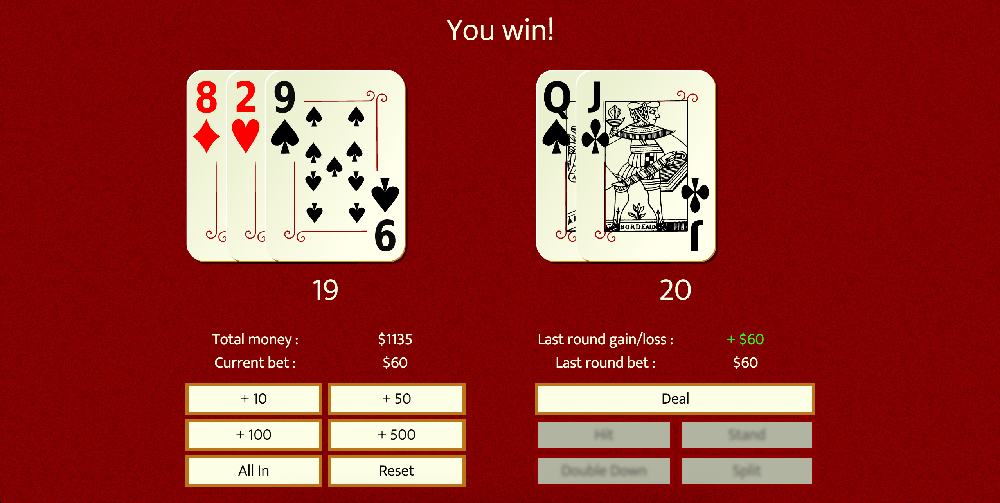

# Blackjack

######
[Live Project](http://jc_blackjack.surge.sh/)   |   [Overview](https://github.com/johnnycopes/blackjack/#overview)   |   [What I Used](https://github.com/johnnycopes/blackjack#what-i-used)   |   [MVP](https://github.com/johnnycopes/blackjack#mvp-minimum-viable-product)   |   [Challenges](https://github.com/johnnycopes/blackjack#challenges--solutions)   |   [Code](https://github.com/johnnycopes/blackjack#code-snippets)   | [Screenshots](https://github.com/johnnycopes/blackjack#screenshots)   |

## Overview:
This is a traditional Blackjack (aka 21) game. It was initially assigned as an exercise in class, but I wanted to turn mine into a full-fledged project. Features include responsive design and ability to bet, double down, and split.

## What I used:
**Languages:**  
* HTML5
* CSS
* SCSS
* JavaScript + jQuery

**Other:**  
* Cards from [openclipart](https://openclipart.org/)
  * *Ace - 10 made by nicubunu -- http://nicubunu.ro*
  * *Face cards made by mariotomo -- https://openclipart.org/user-detail/mariotomo*


## MVP (Minimum Viable Product):
The original assignment was to create a working Blackjack game.

**Initial MVP**
* Ability to hit and stand
* The game recognizes when the player wins, loses, or pushes against the dealer
* Creating a client-facing interface that corresponds with what's happening in underlying code
* Write the program in a functional programming style and then convert it to an object-oriented programming style

**Stretch Goals**
* Device-responsiveness
* Implement money and ability to bet
* Ability to double down and split
* Improve the look of the game and find better card images
* Implement timeouts and transitions to smooth the gameplay

## Challenges & Solutions:
Below are some of the most notable challenges I came across while making this project:

1.  **Challenge:** After getting the MVP up and running, convert all JS code from the function style to an OO style.

    **Solution:** This was one of the main tasks of the original assignment and I found it to be excellent practice. I divided the game into different components in order of complexity (card, hand, deck, overall game) and then combed through my original program and sorted my existing functions into either a method or property of each one. As the size of the program grew, I also ordered the methods of each constructor alphabetically in order to make changes or look them up more quickly.

2.  **Challenge:** Keeping things structured. There are a lot of different possible scenarios in the game and maintaining organization was tough. At times it felt like I was writing spaghetti code.

    **Solution:** The conversion to OOP definitely helped because it compartmentalized the many procedures of the game. Adding game state variables as markers made it easier to manipulate the control flow because I could hinge potential courses of action on conditional statements. Writing comments to summarize what code was doing also helped me keep track of what happens where.

3.  **Challenge:** The addition of Split. It significantly affected every aspect of the game and probably doubled the time I spent on this project.

    **Solution:** Lots of state variables. The Hit and Stand buttons are the main means of taking action in the game, but those two buttons act very differently depending on what the current scenario is. I found that the easiest way to manage this was a) create methods on constructor functions whenever possible to handle calculations and b) divide the control flow up into broad, easy-to-follow paths. Visually, Split was a challenge because now I had to make room for an additional hand on the table. My solution was to put the two hands side by side, but stack the additionally drawn cards on top of each other rather than spreading them out as usual. This kills visibility of the hand, but it was a necessary sacrifice because otherwise there was simply no room to have both. I also created a CSS class that comes into play during Split to indicate to the user which of their two hands they're controlling at the moment.

4. **Challenge:** Using SCSS for the first time.

    **Solution:** This wasn't too difficult, but it did take a little while to figure out how to get started because I had never used SCSS before. I like its features, though, and will definitely be using it in future projects.


## Code Snippets

Starting a new game by clicking on 'Deal':
```JavaScript
Game.prototype.deal = function() {
  // change button availability
  $('.hit, .stand').attr('disabled', false);
  $('.deal').attr('disabled', true);
  $('.betting .buttons').hide();
  // shuffle deck(s) and deal cards
  this.gameDeck.shuffle();
  this.gameDeck.deal(this.dealerHand, '.dealer-hand', 'hole');
  this.gameDeck.deal(this.playerHand, '.player-hand');
  this.gameDeck.deal(this.dealerHand, '.dealer-hand');
  this.gameDeck.deal(this.playerHand, '.player-hand');
  // conceal dealer total and display user total
  $('.dealer-points').text('?');
  $('.player-points').text(this.playerHand.getPoints());
  if (this.dealerHand.getPoints() === 21 && this.playerHand.getPoints() === 21) {
    this.outcome('push')
    this.dealerHand.revealHole();
    $('.dealer-points').text('Blackjack');
    $('.player-points').text('BLACKJACK HOT DAMN!');
    $('.messages').append('<h1>Push</h1>');
  }
  else if (this.dealerHand.getPoints() === 21) {
    this.outcome('lose');
    this.dealerHand.revealHole();
    $('.dealer-points').text('Blackjack');
    $('.messages').append('<h1>Dealer wins</h1>');
  }
  else if (this.playerHand.getPoints() === 21) {
    this.outcome('blackjack')
    this.dealerHand.revealHole();
    $('.dealer-points').text(this.dealerHand.getPoints());
    $('.player-points').text('BLACKJACK HOT DAMN!');
    $('.messages').append('<h1>You win!</h1>');
  }
  else if (this.playerHand.getPoints() === 11) {
    this.showDoubleDownBtn();
  }
  else if (this.playerHand.seeCard(1).point === this.playerHand.seeCard(2).point) {
    this.showSplitBtn();
  }
};
```

Clicking on 'Hit':
```JavaScript
Game.prototype.hit = function() {
  // disable 'double-down' and 'split' btns if the user doesn't click them right away
  $('.double-down, .split').attr('disabled', true);
  if (this.currentHand === 'hand1') {
    // split/no split determines how the card looks when dealt and what happens when the first hand busts
    if (this.splitInPlay) {
      this.gameDeck.deal(this.playerHand, '#hand1 .player-hand', 'split');
      $('#hand1 .player-points').text(this.playerHand.getPoints());
      if (this.playerHand.getPoints() > 21) {
        this.splitInPlay = false;
        this.currentHand = 'hand2';
        $('#hand1').removeClass('currentHand');
        $('#hand2').addClass('currentHand');
      }
    }
    else {
      // 'hit' under most circumstumstances
      this.gameDeck.deal(this.playerHand, '#hand1 .player-hand')
      $('#hand1 .player-points').text(this.playerHand.getPoints());
      if (this.playerHand.getPoints() > 21) {
        this.outcome('lose');
        $('.messages').append('<h1>Player busts</h1>');
        $('#hand1').removeClass('currentHand');
      }
    }
  }
  else if (this.currentHand === 'hand2') {
    this.gameDeck.deal(this.playerHand2, '#hand2 .player-hand', 'split');
    $('#hand2 .player-points').text(this.playerHand2.getPoints());
    if (this.playerHand2.getPoints() > 21) {
      $('#hand2').removeClass('currentHand');
      // call 'stay' to evaluate outcomes
      this.stand();
    }
  }
};
```

Clicking on 'Stand':
``` JavaScript
Game.prototype.stand = function(caller) {
  // if splitting, pass opportunity to split to hand2
  if (this.splitInPlay) {
    this.splitInPlay = false;
    this.currentHand = 'hand2';
    $('#hand1').removeClass('currentHand');
    $('#hand2').addClass('currentHand');
  }
  // if splitting, calculate the outcome of both of the player's hands
  else if (this.currentHand === 'hand2') {
    this.currentHand = 'hand1';
    this.dealerHand.revealHole();
    while (this.dealerHand.getPoints() < 17) {
      this.gameDeck.deal(this.dealerHand, '.dealer-hand');
    }
    var dealerPoints = this.dealerHand.getPoints(),
        hand1Points = this.playerHand.getPoints(),
        hand2Points = this.playerHand2.getPoints();
    $('.dealer-points').text(dealerPoints);
    // evaluate player hands
    if (dealerPoints <= 21) {
      if (hand1Points > 21) {
        this.playerHand1Outcome = 'lose';
      }
      else if (hand1Points > dealerPoints) {
        this.playerHand1Outcome = 'win';
      }
      else if (hand1Points < dealerPoints) {
        this.playerHand1Outcome = 'lose';
      }
      else {
        this.playerHand1Outcome = 'push';
      }
      if (hand2Points > 21) {
        this.playerHand2Outcome = 'lose';
      }
      else if (hand2Points > dealerPoints) {
        this.playerHand2Outcome = 'win';
      }
      else if (hand2Points < dealerPoints) {
        this.playerHand2Outcome = 'lose';
      }
      else {
        this.playerHand2Outcome = 'push';
      }
    }
    else {
      if (hand1Points <= 21) {
        this.playerHand1Outcome = 'win';
      }
      else {
        this.playerHand1Outcome = 'lose';
      }
      if (hand2Points <= 21) {
        this.playerHand2Outcome = 'win';
      }
      else {
        this.playerHand2Outcome = 'lose';
      }
    }
    this.splitOutcome(this.playerHand1Outcome, this.playerHand2Outcome);
  }
  // 'stand' protocol for most games (player has only one hand)
  else {
    // disable game action buttons
    $('.hit, .stand, .double-down, .split').attr('disabled', true);
    $('#hand1, #hand2').removeClass('currentHand');
    // dealer's turn
    this.dealerHand.revealHole();
    while (this.dealerHand.getPoints() < 17) {
      this.gameDeck.deal(this.dealerHand, '.dealer-hand');
    }
    $('.dealer-points').text(this.dealerHand.getPoints());
    if (this.dealerHand.getPoints() > 21) {
      this.outcome('win');
      $('.messages').append('<h1>Dealer busts</h1>');
    }
    else if (this.dealerHand.getPoints() < this.playerHand.getPoints()) {
      this.outcome('win');
      $('.messages').append('<h1>You win!</h1>');
    }
    else if (this.dealerHand.getPoints() > this.playerHand.getPoints()) {
      this.outcome('lose');
      $('.messages').append('<h1>Dealer wins</h1>');
    }
    else {
      this.outcome('push');
      $('.messages').append('<h1>Push</h1>');
    }
    // if stand was called by clicking 'double down', do additional work
    if (caller === 'double-down') {
      this.bet = this.bet / 2;
      $('.bet').text(this.bet);
      $('.double-down').attr('disabled', true);
    }
  }
};
```

## Screenshots




********


# Blackjack

### Live site: _coming soon_

This is a traditional game of Blackjack (aka "21"). Features ability to bet, double down, and split up to two hands. Built with HTML, SCSS, and TypeScript.

This project has enjoyed a long life of growth and refactoring: I originally wrote it in a functional programming style and then refactored it in an OO style (November 2016); then I refactored it to include Webpack, ES2015 features, and CSS Grid (September 2017); and finally, I converted the JavaScript to TypeScript (March 2018).

#### Goals of this project:

- Write everything in TS with no framework
- Set up a custom Webpack configuration to load all files and assets
- Make a sensible layout that leverages CSS Grid
- Deploy a lightweight production build (lots of images to load!)


#### Local installation:

To run this locally on your machine, simply clone the repo and enter the following commands into your CLI:

```
npm install
npm run start
```